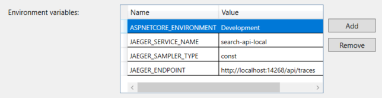
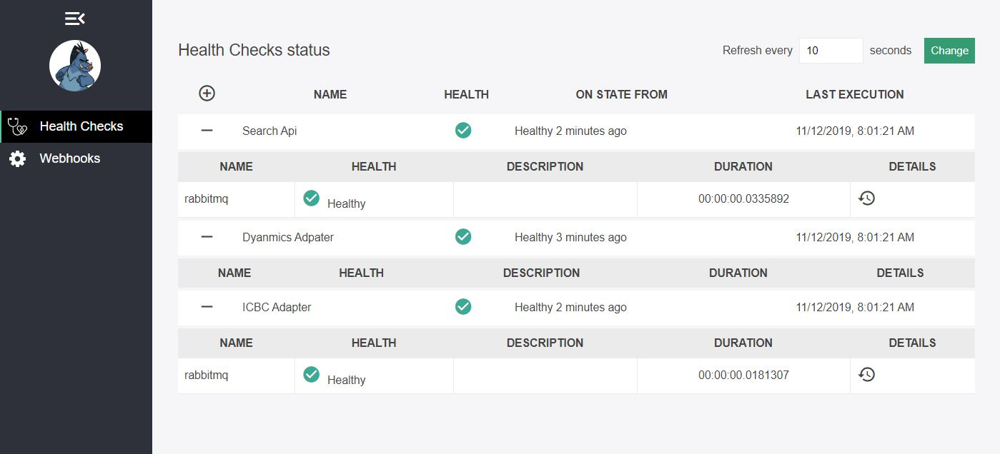

# FAMS3

## Project Structure

    .
    ├── app                     # Application Source Files.
    |   ├── SearchApi           # Search Api
    |   └── DynamicAdapter      # Dynamic Adapter
    ├── .gitignore              # Git ignore.
    └── README.md               # This file.
    └── openshift               # Build and Deploy Configurations.
    └── bin                     # Useful scripts.

## RUN

Create a `.env` file from the `.env.template`

Configure the necessary variables in `.env`

```shell
docker-compose up
```

| app | url |
| --- | --- |
| Search API Swagger UI | [http://localhost:5050/swagger](http://localhost:5050/swagger) |
| Search API OpenApi Specification | [http://localhost:5050/swagger/v1/swagger.json](http://localhost:5050/swagger/v1/swagger.json) |
| Search API Health | [http://localhost:5060/health](http://localhost:5060/health) |
| Dynamics Adapter Health | [http://localhost:5060/health](http://localhost:5060/health) |
| Sample Adatpter Health | [http://localhost:5052/health](http://localhost:5060/health) |
| RabbitMq Management Console | [http://localhost:15672/](http://localhost:15672) |
| Jaeger OpenTrace Monitoring | [http://localhost:16686/search](http://localhost:16686/search) |
| HealthChecks UI | [http://localhost:6060/healthchecks-ui](http://localhost:6060/healthchecks-ui) |

## SearchApi

FAMS-search-api is a dotnet core rest service to execute people search accross multiple data providers.

### Configuration

Configure RabbiMq using the following ENV variables:

| Property | Required | Description |
| --- | --- | --- |
| RABBITMQ__HOST | no | RabbitMq Host |
| RABBITMQ__PORT | no | RabbitMq Port |
| RABBITMQ__USERNAME | no | RabbitMq UserName |
| RABBITMQ__PASSWORD | no | RabbitMq Password |

*Notes*

> the variables key have 2 underscores

### Search Event Notifications

If the WebHooks section is configured, SearchApi automatically posts a new notification into the webhook collection. The WebHook configuraton in SearchApi is

To enable Person Search notification, configure the SearchApi WebHooks settings.

```json
"SearchApi": {
    "WebHooks": [
      {
        "Name": "dynadapter",
        "Uri":  "http://localhost:5000/PersonSearch",
      }
    ] 
  }
```

With this configuration the searchApi will post Event to `http://localhost:5000/PersonSearch/{event}/{id}` where {id} is a global unique identifier for the search request . the content of the payload is  dependent on the event.

### Search Adapters Events


#### Person Search Completed

When the Adapter finds a match for a particular person, it raises an event that post search completed to dynadapter with the result message.

##### PayLoad

```json
{
	"person": {
		"firstName": "My name is first",
		"lastName": "My name is last",
		"dateOfBirth": "0001-01-01T00:00:00"
	},
	"personIds": [{
		"kind": "DriversLicense",
		"issuer": "BC Province",
		"number": "123123123"
	}, {
		"kind": "DriversLicense",
		"issuer": "AB Province",
		"number": "123123123"
	}],
	"searchRequestId": "00000000-0000-0000-0000-000000000000",
	"timeStamp": "0001-01-01T00:00:00",
	"providerProfile": {
		"name": "Provider"
	}
}
```

#### Person Search Accepted

When a person Search is accepted by data provider, meaning it has sufficient information to conduct a search. An event is raised and posted to dynadapter.

##### PayLoad

```json
{
	
	"searchRequestId": "00000000-0000-0000-0000-000000000000",
	"timeStamp": "0001-01-01T00:00:00",
	"providerProfile": {
		"name": "Provider"
	}
}
```


#### Person Search Rejected

When a person Search does not meet the minimal requirement for the adapter to conduct a search.  An event is raised and posted to dynadapter.

##### PayLoad

```json
{

	"reasons": [{
		"propertyname": "FirstName",
		"errormessage": "firstName is required"
	}, {
		"propertyname": "LastName",
		"errormessage": "LastName is required"
	}],
	"searchRequestId": "00000000-0000-0000-0000-000000000000",
	"timeStamp": "0001-01-01T00:00:00",
	"providerProfile": {
		"name": "Provider"
	}
}
```

#### Person Search Failed

When the adpater throws an unknown exception. An event is raised and posted to dynadapter.

##### PayLoad
```json
{
	"cause": {
		"message": "We are unable to proceed"
	},
	"searchRequestId": "00000000-0000-0000-0000-000000000000",
	"timeStamp": "0001-01-01T00:00:00",
	"providerProfile": {
		"name": "Provider"
	}
}
```


#### Person Search Event List and Routes
Search Api Post events to the following routes schema host/PersonSearch/{event}/{searchRequestId}.

| Event | URL |
| --- | --- |
| Completed | host/PersonSearch/Completed/{searchRequestId}
| Accepted | host/PersonSearch/Accepted/{searchRequestId}
| Rejected | host/PersonSearch/Rejected/{searchRequestId}
| Failed | host/PersonSearch/Failed/{searchRequestId}

### OpenApi

The Search Api uses [NSwag](https://github.com/RicoSuter/NSwag) to autogenerate api specification from the code.
To turn on the swagger Ui, set `ASPNETCORE_ENVIRONMENT=Development` environment variable, this should not be use in `production`.

### Tracing

The Search Api uses [opentracing](https://opentracing.io/) instrumentation for distributed tracing.

It uses [Jaeger](https://www.jaegertracing.io/) implementation to monitor and troubleshoot transactions and reference the [jeager-client-csharp](https://github.com/jaegertracing/jaeger-client-csharp).

The csharp client is set up to use [configuration via environment](https://github.com/jaegertracing/jaeger-client-csharp#configuration-via-environment).

*Notes*

> Set `JAEGER_SERVICE_NAME` if you want the tracer to ship tracing logs.  
> Set `JAEGER_SAMPLER_TYPE=const` if you want to sample all your traces.

### Run

download and install [dotnet core 3.0](https://dotnet.microsoft.com/download/dotnet-core/3.0)

Optionaly you can configure `jaeger` client to send traces:


Run

```shell
cd app/SearchApi/SearchApi.Web
dotnet run
```

Application health can be checked [here](http://localhost:5000/health).

FAMS-search-api is a dotnet core rest service to execute people search accross multiple data providers.

## Search Adapters

The Search Adpaters a worker that execute a search for a specific data providers.

### Configuration

| Property | Required | Description |
| --- | --- | --- |
| RABBITMQ__HOST | no | RabbitMq Host |
| RABBITMQ__PORT | no | RabbitMq Port |
| RABBITMQ__USERNAME | no | RabbitMq UserName |
| RABBITMQ__PASSWORD | no | RabbitMq Password |


## DynamicAdapter

FAMS-dynamic-adapter is a dotnet core rest service that polls dynamics to retrieve ready to search request and execute search using the Search API.

### Configuration

| Property | Required | Description |
| --- | --- | --- |
| RABBITMQ__HOST | no | RabbitMq Host |
| RABBITMQ__PORT | no | RabbitMq Port |
| RABBITMQ__USERNAME | no | RabbitMq UserName |
| RABBITMQ__PASSWORD | no | RabbitMq Password |
| SCHEDULER__CRON | no | a dotnet Quartz cron expression |
| SEARCHAPI__BASEURL | yes | the base path of the search api |
| OAUTH__RESOURCEURL | yes | the resource URL you required the token for|
| OAUTH__CLIENTID | yes | the Oauth Client id |
| OAUTH__SECRET | yes | the Oauth secret |
| OAUTH__OAUTHURL | yes | the Oauth URL |
| OAUTH__USERNAME | yes | the Oauth username |
| OAUTH__PASSWORD | yes | the Oauth password |

*Notes*

> the variables key have 2 underscores

### Tracing

The Dynamic Adapter uses [opentracing](https://opentracing.io/) instrumentation for distributed tracing.

It uses [Jaeger](https://www.jaegertracing.io/) implementation to monitor and troubleshoot transactions and reference the [jeager-client-csharp](https://github.com/jaegertracing/jaeger-client-csharp).

The csharp client is set up to use [configuration via environment](https://github.com/jaegertracing/jaeger-client-csharp#configuration-via-environment).

*Notes*

> Set `JAEGER_SERVICE_NAME` if you want the tracer to ship tracing logs.  
> Set `JAEGER_SAMPLER_TYPE=const` if you want to sample all your traces.

### Run

download and install [dotnet core 3.0](https://dotnet.microsoft.com/download/dotnet-core/3.0)

Optionaly you can configure `jaeger` client to send traces:



Run

```shell
cd app/DynamicAdapter/DynamicAdapter.Web
dotnet run
```

## Monitoring

### AspNetCore Diagnostics 

All dotnet core applications support [AspNetCore Diagnostics](https://github.com/Xabaril/AspNetCore.Diagnostics.HealthChecks) and are compatible with [HealthCheck UI](https://github.com/Xabaril/AspNetCore.Diagnostics.HealthChecks#healthcheckui-and-failure-notifications)

Look at the [HealthCheck UI docker image](https://github.com/Xabaril/AspNetCore.Diagnostics.HealthChecks/blob/master/docs/ui-docker.md) for deployment and configure it using environment variables.

You can find a configuration exemple in our [docker-compose.yml](docker-compose.yml) under watchdog.



