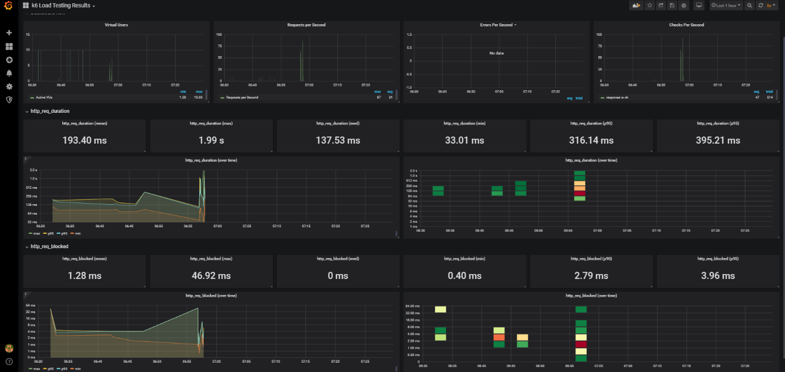

#Load Testing for Search API

###Daily Usage Limit:

Based on the statistics provided, there are an average of 70 incoming search requests per day. Hence Load Testing inputs are designed assuming that all the requests/day are done simultaneously.

###Load Testing Inputs

**Base Url:** searchapi-fams3-dev.pathfinder.gov.bc.ca

**Resource:** /people/search

**Request:** POST

**Method:** Simple

    Virtual Users: 25 (Number of Virtual Users)
    Iterations: 120 (Each vu will make 120 requests)
    Total Requests for 2 minutes: 3000 requests (Actual Number of requests per day: 70)
    
**Method:** Burst
   
    Total Duration: 36 seconds, Target: 200
    stages: 
        {duration: "0.1m", target: 60}, For the first 6 seconds, ramp up 60 users
        {duration: "0.05m", target: 60}, For the next 3 secs, stay flat at 60 users
        {duration: "0.1m", target: 100}, For the next 6 seconds, reach 100 users
        {duration: "0.05m", target: 100}, For the next 3 seconds, stay flat at 100 users
        {duration: "0.1m", target: 200}, For the next 6 seconds, reach 200 users
        {duration: "0.05m", target: 200}, For the next 3 seconds, stay flat at 200 users
        {duration: "0.1m", target: 100}, For the next 6 seconds, ramp up down to 100 users
        {duration: "0.05m", target: 0}, For the next 3 seconds, ramp up down to 0 users
        
 **Tool:**
   1.	Postman
   2.	 k6 Scripts
   
  **Load Testing Metrics:**
  
   | Metric name | Type  | Description |
   | ------- | --- | --- |
   | http_reqs | Counter | How many HTTP requests has k6 generated, in total |
   |http_req_blocked|Trend|Time spent blocked (waiting for a free TCP connection slot) before initiating request.|
   |http_req_looking_up|Trend|Time spent looking up remote host name in DNS.|
   |http_req_connecting|Trend|Time spent establishing TCP connection to remote host|
   |http_req_tls_handshaking|Trend|Time spent handshaking TLS session with remote host.|
   |http_req_sending|Trend|Time spent sending data to remote host.|
   |http_req_waiting|Trend|Time spent waiting for response from remote host (a.k.a. "time to first byte", or "TTFB").|
   |http_req_receiving|Trend|Time spent receiving response data from remote host.|
   |http_req_duration|Trend|Total time for the request. It's equal to http_req_sending + http_req_waiting + http_req_receiving (i.e. how long did the remote server take to process the request and respond, without the initial DNS lookup/connection times).|
 
   **Results:**
    
   Command Line Result Example:
    
    
   Dashboard Example:
   
   
        
 